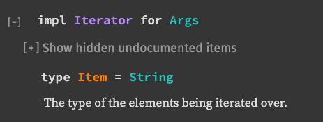

# 003 accessing command line arguments with iterators

```rust
fn main() {
    let api_token = std::env::var("API_TOKEN").expect("expected there to be an api token");

    let mut arg_iterator = std::env::args();
    arg_iterator.next();
    let args: String = arg_iterator.collect();

    dbg!(args);
}
```

When we run our weather program, we want to be able to pass in arguments to search for a location. For example, if we wanted to search for the weather in San Francisco we could write the following.

```shell
weather-cli san francisco
```

Using `cargo run`, we would write it like this instead. Since `cargo run` is its own program, the `--` is used to forward the arguments "san francisco" to _our_ binary instead of letting cargo consume them.

```shell
cargo run -- san francisco
```

(remember that you'll need to have the `API_TOKEN` set in the environment as we discussed in the last section)

## Arguments

To access the arguments that are being passed to our CLI application, we can use another function from the `std::env` module: [`std::env::args`](https://doc.rust-lang.org/stable/std/env/fn.args.html).

This time, we'll declare our variable to be mutable using `let mut`. We need this for the `.next` call.

<Aside>
If you read the type signature for [`.next`](https://doc.rust-lang.org/std/iter/trait.Iterator.html#tymethod.next), you will see `&mut self` in the type signature, specifically as an argument to the function. This means that the value we're calling it on must be a mutable reference.
</Aside>

`std::env::args` returns the struct type `std::env::Args` (note the capital A). A struct is a bit like an object in JavaScript: it can have fields and values and we can call functions on it.

So how does the `.next` call get there?

It turns out that `std::env::Args` implements a trait called [`Iterator`](https://doc.rust-lang.org/std/iter/trait.Iterator.html). Any type that implements the `Iterator` trait has a [`.next`](https://doc.rust-lang.org/std/iter/trait.Iterator.html#tymethod.next) function that we can call on that type. So if we have the value from calling `std::env::args`, which is a `std::env::Args` struct, we can call `.next` on that value because `std::env::Args` implements `Iterator`.

If we call `.next` enough times on `arg_iterator`, we'll reach the end of the arguments.

Additionally, we know that the type of each argument is a `String` because the implementation (`impl Iterator for Args` on [this page](https://doc.rust-lang.org/stable/std/env/struct.Args.html) that documents the `Args` struct) specifies it as such. All Iterators have a well-specified type for their items.



We will call `.next` once manually because the arguments from the CLI typically include the binary name. By calling `.next` once, we can skip the binary name. Using our original example:

```
weather-cli san francisco
```

would result in the following arguments. I've used JavaScript syntax for clarity here.

```js
const arguments = ["weather-cli", "san", "francisco"];
```

and after calling `.next` on our args we would be left with

```js
const arguments = ["san", "francisco"];
```

## .collect

It would be kind of a pain to call `.next` manually for all of the possible input lengths someone could pass to our program though. It's easy to imagine lengths of one (`beijing`) and lengths of two (`san francisco`) but there are plenty more possibilities.

In our case we want to take all of the arguments passed to our CLI and send them to the weather service as an HTTP request. This means we want the cli arguments as a string instead of a list of values. We can use [`.collect`](https://doc.rust-lang.org/std/iter/trait.Iterator.html#method.collect) to achieve this.

`.collect` is what we call "consuming" in that it will consume the entire iterator we call it on. This is great for us because it frees us from the burden of trying to figure out which `.next` call is the last one.

`.collect` is also one of the more powerful functions in the standard library. It is capable of converting from an iterator into many different collection types, and even types that are not normally considered collections. In our case, we're going to use it to convert from our iterator-of-Strings into a single String.

Because `.collect` is so generic, we often need to give Rust a bit of a type hint to tell it what type we want the return type to be. So when we declare `args`, we also specify that `args` is a `String`, and `.collect` will know what to do to make a `String`.

## fin

We've added the following to our program, scooping up all of the arguments to our CLI, skipping the binary name, and converting the arguments into a `String` for later use.

```rust
let mut arg_iterator = std::env::args();
arg_iterator.next();
let args: String = arg_iterator.collect();

dbg!(args);
```

Feel free to add a `dbg!` before running `cargo run` once again.

```shell
API_TOKEN=<my-token> cargo run -- beijing
```
